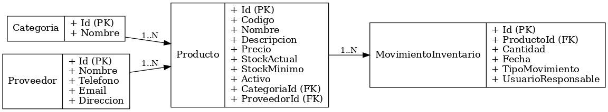

# API_Inventario
### Practica API Rest con .NET Core
Auto estudio para mejorar y actualizar mis habilidades en el entorno de .NET.

# 📑 Documentación de Proyecto – API de Inventario

## 1. Introducción
Este documento describe el diseño y especificaciones de una **API REST para la gestión de inventario** 
de una empresa de distribución de productos tecnológicos.  
El objetivo es proporcionar un sistema centralizado que permita:
- Administrar productos, categorías y proveedores.  
- Registrar movimientos de stock (entradas/salidas).  
- Garantizar trazabilidad, consistencia y escalabilidad.  

---

## 2. Objetivos
- Implementar un sistema de gestión de inventario accesible mediante API REST.  
- Permitir la administración de productos, categorías y proveedores.  
- Registrar movimientos de stock (entradas/salidas) con detalle.  
- Facilitar integración con aplicaciones externas (ERP, e-commerce).  
- Garantizar validaciones de datos, consistencia y seguridad básica.  

---

## 3. Alcance del Proyecto
La API cubrirá los siguientes módulos principales:

- **Productos:** CRUD, relación con categorías y proveedores.  
- **Categorías:** Gestión de categorías de productos.  
- **Proveedores:** Registro y gestión de proveedores.  
- **Movimientos:** Registro de entradas/salidas con auditoría.  

---

## 4. Requerimientos Funcionales
- **RF01:** CRUD de productos.  
- **RF02:** Filtrar productos por categoría/proveedor.  
- **RF03:** No permitir stock negativo.  
- **RF04:** Generar alerta cuando el stock actual sea menor al mínimo.  
- **RF05:** CRUD de categorías.  
- **RF06:** CRUD de proveedores.  
- **RF07:** Registrar movimientos de inventario.  
- **RF08:** Actualizar stock automáticamente.  
- **RF09:** Consultar historial de movimientos.  
- **RF10 (Opcional):** Autenticación con JWT y roles.  

---

## 5. Requerimientos No Funcionales
- **Rendimiento:** respuesta < 200 ms en operaciones simples.  
- **Escalabilidad:** compatible con SQL Server y PostgreSQL.  
- **Documentación:** Swagger/OpenAPI.  
- **Validaciones:** DataAnnotations + FluentValidation.  
- **Pruebas:** Unitarias básicas con xUnit.  

---

## 6. Modelo de Datos
Las entidades principales y sus relaciones son:  

---

## 7. Endpoints Propuestos

### Productos
- `GET /api/productos?pageNumber=1&pageSize=10` (los query son opcionales)
- `GET /api/productos?pageNumber=1&pageSize=10&categoriaId=1&proveedorId=1` (los query son opcionales)
- `GET /api/productos/{id}`
- `GET /api/productos/stock-bajo?pageNumber=1&pageSize=10`  
- `POST /api/productos`  
- `PUT /api/productos/{id}`  
- `DELETE /api/productos/{id}`  

### Categorías
- `GET /api/categorias?pageNumber=1&pageSize=10` (los query son opcionales)
- `GET /api/categorias/{id}`  
- `POST /api/categorias`  
- `PUT /api/categorias/{id}`  
- `DELETE /api/categorias/{id}`  

### Proveedores
- `GET /api/proveedores?pageNumber=1&pageSize=10` (los query son opcionales)
- `GET /api/proveedores/{id}`  
- `POST /api/proveedores`  
- `PUT /api/proveedores/{id}`  
- `DELETE /api/proveedores/{id}`  

### Movimientos
- `POST /api/movimiento-inventario`
- `GET /api/movimiento-inventario?pageNumber=1&pageSize=10` (los query son opcionales)

---

## 8. Futuras mejoras
- **Seguridad** Integrar seguridad con JWT y roles. 
- **Reportes avanzados de inventario** Generar reportes avanzados.
- **Aviso de stock bajo** Alertar al usuario de stock bajo.

---
